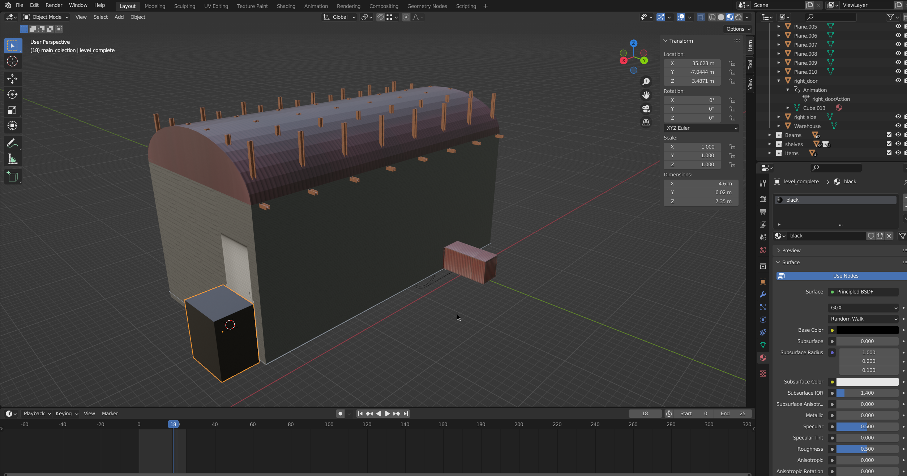
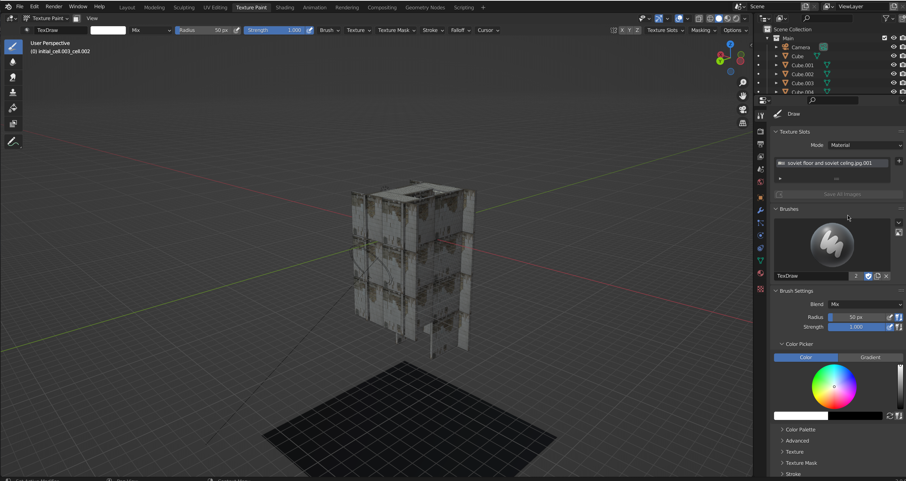
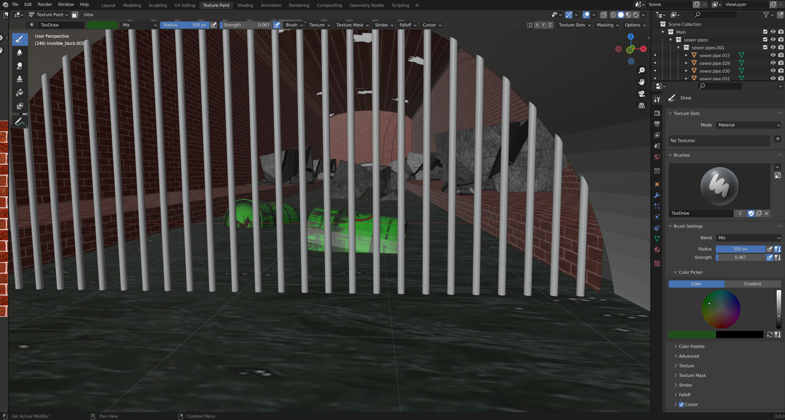
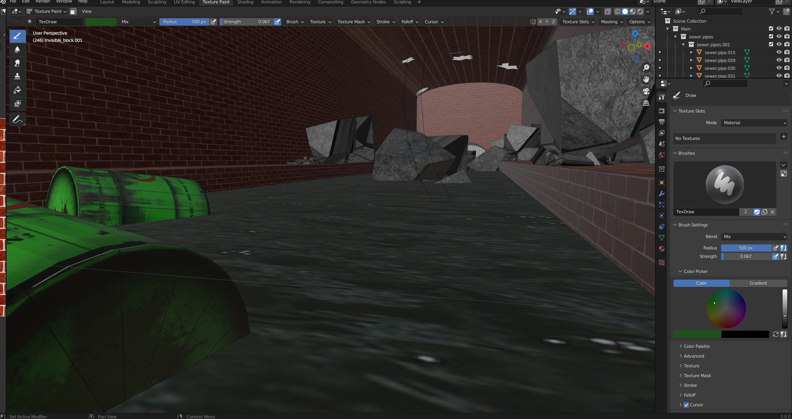
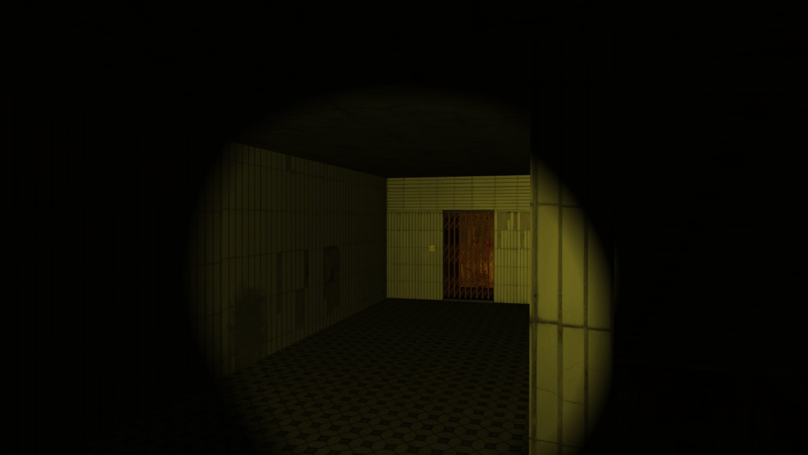
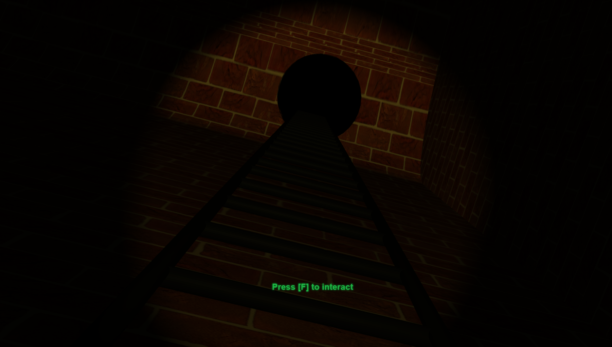
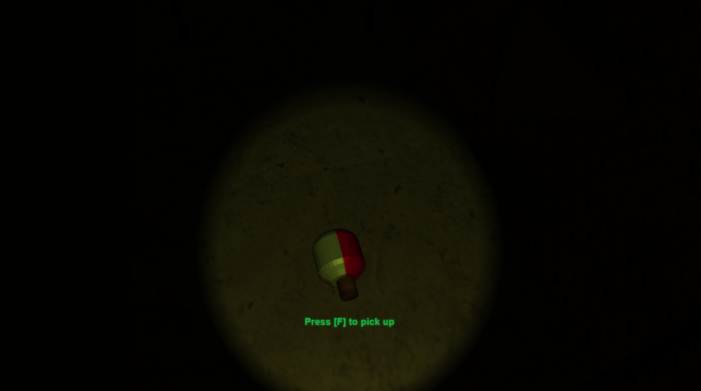
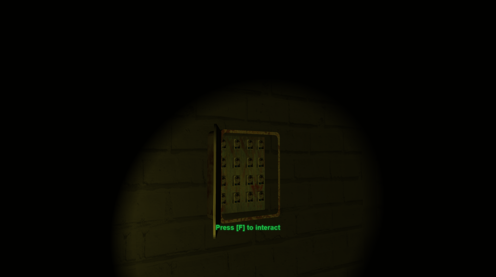

<head>
<style type="text/css">
.logo {
  float: right;
  width:40%;
  height:25%;
}
</style>
</head>

<body>
<div class="logo">

</div>

<h1>Seminarksa naloga: Računalniška igra Mansion of Terror</h1>
<h2>Avtorji: Mark Loboda, Filip Jeretina, Irinej Slapal</h2>

</body>

<div style="page-break-after: always;"></div>

## Povzetek

Igra Mansion of Terror je strašljiva sestavljanka. Vse sobe so temne, edina svetloba prihaja iz svetilke kar poskrbi za bolj strašno vzdušje, v ozadju pa se tudi predvaja strašljiva glasba.
Svetilka je realizirana v glsl senčilniku. V igri so objekti s katerimi igralec lahko interektira. Ob interakciji se lahko zgodijo različne stvari, ponavadi pa so to animacije.

## 1.) Opis sveta
Igra vsebuje tri sobe. Igralec mora priti čez vse tri sobe, da lahko zbeži in s tem zaključi igro.
Svet smo opremili z različnimi teksturami, da je igranje kar se da razburljivo. Dodali smo razne animacije padanja skal, razdrtja stehe in tal in podobno.

## Ključne lokacije
Klučne lokacije v igri so lokacije interakcij, kjer mora igralec interaktirati s predmeti, da lahko napreduje.
To so:
- V prvi sobi:
    - varovalka, ki jo mora igralec najti in jo prinesti do varovalne omarice,
    - varovalna omarica, kamor igralec vstavi varovalko,
    - dvižna vrata, ki se lahko odprejo le, ko igralec poveže električni krog z vstavljanjem varovalke v omarico,
    - stikalo za dvižna vrata

- V drugi sobi:
    - prostor, na koncu stopnic, kjer se stopnice udrejo, in igralec z njimi pade v črno globino, kjer vstopi v tretjo sobo,

- V tretji sobi:
    - prostor na drugem koncu kanalizacije, kjer je lestev, katero mora igralec doseči za napredovanje,
    - do lestve za napredovanje pride s prečaknjem kanalizacijskega potoka na večih mestih, s pomočjo skakanja po odpadkih in ruševinah, ki so v potoku
- V četrti sobi:
  - igralec se ponovno vrne v drugo sobo, kjer se nahaja dvigalo
  - ob prisku na gumb se dvigalo odpre, igralec pa zbeži in s tem zmaga
  - to dvigalo v prvem obisku sobe ni bilo možno odpreti

## Velikost
Velikost sob in objektov se zgleduje po objektih v realnem svetu. V prvi sobi smo naredili skladišče zelo visoko, da to vzbuja občutje ogromnosti. Svet igre so samo notranji prostori in iz njih v poteku ne odide.

<div style="page-break-after: always;"></div>

## Objekti
Vse modele objektov in sob smo izdelali sami s pomočjo programa Blender, teksture pa smo našli na spletu, nekatere pa modificirali.
Poglavitni objekti so varovalka, varovalna omarica, dvižna vrata, stikalo za dvižna vrata, tla, ki se vdrejo, vrata dvigala in podobno.









## 2.) Igralni pogon in uporabljene tehnologije

Za izdelavo igre smo uporabili samo webgl2 in JavaScript, modele in animacije smo naložili iz gltf blender izvozov. Za bazo igralnega pogona smo uporabili 90-gltf primer iz webgl2-examples repozitorija: https://github.com/UL-FRI-LGM/webgl2-examples/tree/master/examples/90-gltf .

V izhodiščnem primeru je bilo veliko stvari že implementiranih, ker smo hoteli modele vključno z animacijami izvoziti iz blenderja, smo v GLTFLoader.js dodali še podporo za nalaganje animacij. Naredili smo tudi razrez Animation, ki hrani "keyframe"-e in metode za interpolacije med "keyframe"-i.  
Podprte animacije:
- Step interpolation
- Linear interpolation
- Spherical linear interpolation

Izhodiščni primer smo tudi nasploh naredili bolj fleksibilen, npr. naredili smo nov razred MeshRenderer in ga ob nalaganju iz gltf datoteke pripeli na Node objekt. Če bi se v prihodnosti odločili, da bi naš pogon podpiral tudi Armature in animacije armatur bi lahko naredili še en razred, ki bi uporabljal nek drug senčilnik, v render zanki pa bi še vedno klicali samo node.renderer.render()...  

Ker ima naša igra določen nek potek (npr: Preden igralec lahko odpre vrata, mora pritisniti gumb), smo si sami zamislili nek "json" format za opisovanje dogodkov in objektov, s katerimi lahko igralec upravlja.

To smo naredili z razlogom, da je možno tudi v prihodnosti dodati objekte in razširiti igro.  
"Mogoče celo iz trenutnega projekta nastane nov Crysis."

### Primer formata:  

```js
export const scenes = {
  Room1: {
    name: "first_room",
    interactables: [
      { name: "Flashlight", type: "carry", carrying: true },
      {
        name: "Switch",
        type: "interact",
        interact: { play: ["SwitchAnimation"] },
        setConditions: ["switch_active"]
      },
    ],
    animations: {
      SwitchAnimation: {
        after: ["trigger"],
        trigger: ["door_open_action"]
      }
    },
    door_open_action: {
      conditions: ["switch_active"],
      after: ["gotoNextLevel"]
    }
  }
}
```

### Interpretacija zgornjega opisa iz formata:  
- Definirana sta dva interactables objekta. 
  - Prvi je "Flashlight" - svetilka, ki je definiran v vsaki sobi. Svetilka ima definiran tip "carry" `type: carry`, kar pomeni; da ko bo igralčeva interakcija z objektom nošenje le tega. Objekt bo imel od tam naprej rotacijo in translacijo od kamere.
  - Drugi interactable objekt je "Switch" - stikalo. Interakcija z njim požene animacijo "SwitchAnimation", ki je definirana spodaj. Postavi se pogoj `switch_active`.

- Definirani sta dve animaciji. 
  - Prva je "SwitchAnimation". Animacija ima definiran `after: ["trigger"]`. To je ime funkcije, ki se bo izvedla po animaciji, `trigger` pa je funkcija, ki sproži animacijo. V tem primeru se sproži animacija definirana pod trigger "property"-jom -> `trigger: ["door_open_action"]`. Animacija se sproži pogojno: `conditions: ["switch_active"]`.Lahko se sproži več animacij.
  - Ko se sproži door_open_action, se izvede gotoNextLevel, ki naloži naslednjo sobo.

- Poleg tega je še nekaj ostalih stvari, ki jih naš format omogoča. Lahko namesto after imenuješ funkcije, ki se bodo izvedle pred izvajanjem. `before: ["function1", "function2"]`


## Detekcija trkov
V igri smo uporabili tehnologijo detekcije trkov imenovano Axis Aligned Boundary Box. Pogosteje uporabljena je kratica AABB. Pri tej vrsti detekcije trkov ima vsak objekt okoli sebe škatlo, katere robovi so poravnani z svetovnim kordinatnim sistemom. Detekcije trkov preverjamo v datoteki Physics.js.
Ta tehnologija se sliši zelo slaba in zastarela, a je z njo mogoče narediti zelo zanimivo in vživljajoče okolje. Prav tako pa je detekcija zelo hitra.
Detekcijo trkov tudi le za tiste objekte, ki so se v prejšni igralni sliki ("frame"-u) premaknili.


## Fizika
Implementirali smo tudi nekaj fizike. Ko kamera nima več tal pod sabo, pade. Vse je narejeno zelo objektno in omogoča razširitve. Kamera vsebuje seznam, kjer so definirane sile na Y osi. Tako lahko kameri dodaš neko silo od spodaj in jo tako dvigneš, če le ta premaga silo gravitacije. Prav tako poteka izračun gravitacijskega pospeška.
Dodana je tudi možnost skakanja, a le, ko se kamera nahaja na tleh.
Prav tako je dodana možnost hitrega teka ob pritisku tipke "Shift". Tudi tu se preverja, če se kamera nahaja na tleh.

## Teksture in barva objekta
Igralni pogon omogoča renderanje baseColorTexture in baseColorFactor-jev.

## Možne nadgradnje
Zgoraj omenjeno smo stvari delali kar se da strukturirano, da je v prihodnosti možno igro nadgraditi.
Zamislili smo si JSON format za opis animacij in interaktivnih objektov.
Fiziko smo implementirali na način, da bi jo z lahkoto lahko malo spremenili in omogočili celo potiske objektov in podobno.
Prav tako je možnost nadrgadnje druga tehnologija za detekcijo trkov.
Implementirali bi tudi lahko še animacije armatur.
Dodali bi lahko tudi nove zvoke za različne animacije.

<div style="page-break-after: always;"></div>

## Pogled
Uporabili smo Perspektivno kamero uvoženo iz blenderja preko gltf-ja.
Igralca se ne vidi.


## 3.) Uporabniški vmesnik
Naredili smo meni v katerem lahko uporabnik prične z igranjem igre, na voljo pa mu je tudi opcija options. Če uporabnik pritisne na gumb options, se mu odpre meni v, katerem lahko nastavlja glasnost zvoka in občutljivost miške.

Med samim igranjem igre se na ekranu pokaže "Press [F] to interact." ali "Press [F] to carry.". S tem napisom uporabniku sporočimo, da je v bližini nekega objekta, s katerim lahko upravlja.



<div style="page-break-after: always;"></div>

## 4.) Glasba in zvok
Med igranjem igre se predvaja strašljiva glasba. Nivo glasnosti lahko znižamo v meniju.
Poleg glasbe, ki se predvaja konstantno, se ob hoji in teku sliši tudi zvok stopinj.
Zvok stopinj se predvaja hitreje ko tečeš in počasneje ko hodiš.
Dodali smo tudi zvok rušenja kamnov, ki se sproži ob predvajanju animacije v tretji sobi.

## 5.) Gameplay
Igra se začne, ko se igralec zbudi v transportnem zaboju.
Ko igralec odpre vrata zaboja se znajde v zapuščenem skladišču.
V skladišču je veliko polic, ki v sobi sestavljajo labirint, v katerem se mora igralec znajti, da najde varovalko, in električno omarico, v katro vstavi varovalko, da lahko odpre dvižna vrata na koncu sobe in napreduje v naslednjo sobo.
Po skladišču se igralec znajde na stopnišču, vidi vrata dvigala, katera ne more odpredi, igralec lahko raziskuje po sobi, ko se po stopnicah spusti do najnižje točke sobe, se tla sesujejo in igralec pade oz. napreduje v tretjo sobo (kanalizacija).
Ko se igralec pride v kanalizacijo, se sesuje strop in pusti v kanalizacijskem potoku poleg odpadkov tudi ruševine, preko katerih lahko igralec na več mestih preskoči potok in se prebije do lestve, po kateri spleza v zadnjo sobo.
Igralec se spet znajde v drugi sobi, tokrat lahko odpre vrata dvigala, tako zbeži in zaključi igro.

## 6.) Zaključki in možne nadgradnje
Gradnja igre od začetka brez podpore nekega velikega game engine-a je bilo za vse nas nekaj novega. Všeč nam je bilo, da smo imeli popolno kontrolo nad tem kako se stvari dogajajo, je pa res da so nam veliko časa vzele precej osnovne stvari, kot npr. premikanje kamere. Pri računalniški grafiki je dobro to, da včasih tudi če nekaj narobe narediš v senčilniku dobiš kakšen zanimiv efekt na ekranu. Slabost je pa to, da če nekaj narediš preveč narobe na ekranu ne vidiš ničesar razhroščevanje senčilnikov pa je težko.

Veliko časa smo porabili tudi za to, da bi bilo dodajanje novih sob čim enostavnejše in nakoncu so vse sobe ostale neizpiljene. Mogoče smo se malo preveč fokusirali na fleksibilnost naše kode in premalo na gameplay.
